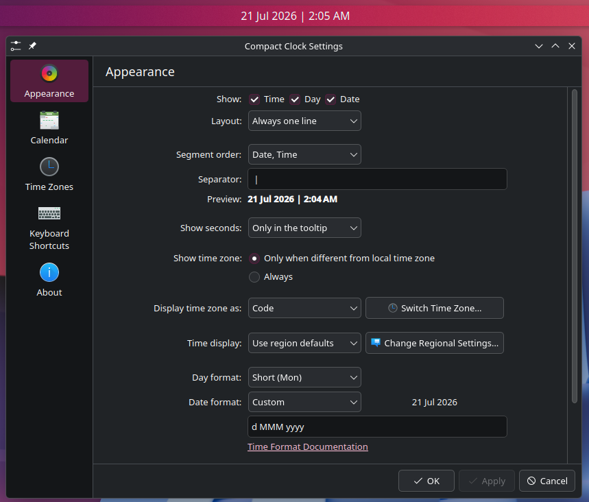

# Compact Clock

A compact **Plasma 6** panel clock with configurable **inline** ordering of time, day, and date — for example:

`20 Jul 2026 | 5:03 PM`

I personally could not stand having my date and time stacked vertically using the default Digital Clock, so I created this widget to show them on one line. This is a much more efficient use of space and retains the original KDE style.


## Install

`./install.sh`  *`install.sh` uses `kpackagetool6` to install under `~/.local/share/plasma/plasmoids/com.github.N0repi.compactclock`. Re-run `git pull` to upgrade.*
Or
Add **Compact Clock** from the widget explorer.

## Configure

Right-click the widget → **Configure Compact Clock** → **Appearance**

- **Show:** Time / Day / Date
- **Segment order:** presets or custom `time,day,date`
- **Separator:** default is ` | ` but it can be any character. eg ` x `
- Day / date / time formats, time zone, font (same ideas as stock)
- The `Date format` is rendered as the primary clock.



Examples:


| Order | Example |
|-------|---------|
| `date,time` | `20 Jul 2026 \| 5:03 PM` |
| `time,date` | `5:03 PM \| 20 Jul 2026` |
| `time,day,date` | `5:03 PM \| Mon \| 20 Jul 2026` |
| `day,date,time` | `Mon \| 20 Jul 2026 \| 5:03 PM` |


## Uninstall

```bash
kpackagetool6 --type Plasma/Applet --remove com.github.N0repi.compactclock
# or: rm -rf ~/.local/share/plasma/plasmoids/com.github.N0repi.compactclock
```

# *Note*
This was tested on Fedora 44 using KDE Plasma Version 6.7.3, using Wayland.

## Inspiration

Inspired by Better Inline Clock on Plasma 5. See [CREDITS.md](CREDITS.md).

## License

GPL-3.0-or-later. See [LICENSE](LICENSE).
